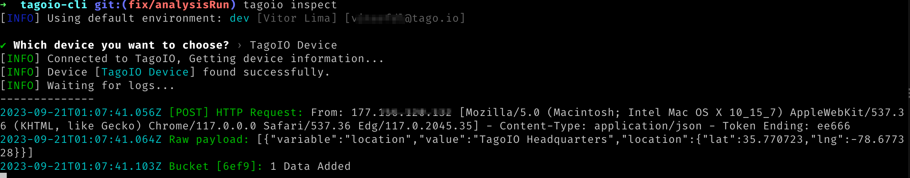

<br/>
<p align="center">
  </img>
</p>

# Table of Contents
- [TagoIO Command Line Tools](#tagoio-command-line-tools)
- [How to Install](#how-to-install)
- [Command List](#command-list)
- [Analysis Runner](#analysis-runner)
- [Credentials Storage](#credentials-storage)
- [tagoconfig.json](#tagoconfigjson)
- [Working with Environments](#working-with-environments)
- [License](#license)

For more information on the latest release notes, please visit the [Release Notes section](https://github.com/tago-io/tagoio-cli/releases)

## TagoIO Command Line Tools
TagoIO Command Line Tools is a CLI tool that allows you to interact with TagoIO platform and manage your applications. You can use it to deploy, run, trigger, and debug your analysis, as well as to inspect, backup, and configure your devices. You can also export your applications from one profile to another.

To use this tool, you need to install it globally with npm and also install the builder dependency. You also need to generate a tagoconfig.json file for your project and a .tago-lock file for your profile. You can work with multiple environments by using the init and set-env commands.

For more information about the commands and options of this tool, please refer to the [Command List](#command-list) section.




# How to Install

Installing the TagoIO Command Line Tools is a straightforward process. Follow these steps to get started:

1. **Preparation**: Ensure that Node.js and npm are installed on your machine. If not, refer to the [installation guide](^1^).
   
2. **CLI Tool Installation**: Open your terminal and run the following command to install the CLI tool globally:
   ```sh
   npm install -g @tago-io/cli
   ```
   
3. **Builder Dependency Installation**: Next, install the builder dependency using the command:
   ```sh
   npm install -g @tago-io/builder
   ```

4. **Project Initialization**: Initialize your project by generating a `tagoconfig.json` file. Use the command below and follow the on-screen instructions to provide your credentials or profile-token (available in your TagoIO account):
   ```sh
   tagoio init
   ```

5. **Profile Token Storage (Optional)**: To store your profile token in a `.tago-lock` file, use the `tagoio login` command. This step also allows you to work with different environments by adding an argument to the command:
   ```sh
   tagoio login
   ```

## Command List
List of commands of the CLI
**Usage**:
- tagoio [options] [command]

**Options**:
-  -V, --version                          output the version number
-  -h, --help                             display help for command

**Commands**:

| Command | Description |
| ---- | ---- |
| init [environment] | create/update the config file for analysis in your current folder |
| login [environment] | login to your account and store profile_token in the .tago/tago-lock |
| set-env [environment] | set your default environment from tagoconfig.ts |
| list-env | list all your environment and show current default |
| | |
| **Analysis** | |
| deploy, analysis-deploy [name] | deploy your analysis to TagoIO |
| run, analysis-run [name] | run your TagoIO analysis from your machine. |
| at, analysis-trigger [name] | send a signal to trigger your analysis TagoIO |
| ac, analysis-console [name] | connect to your Analysis Console |
| ad, analysis-duplicate [ID] | duplicate your Analysis |
| am, analysis-mode [name] | change an analysis or group of analysis to run on tago/external |
| | |
| **Devices** | |
| inspect, device-inspector [ID/Token] | connect to your Device Live Inspector |
| info, device-info [ID/Token] | get information about a device and it's configuration parameters |
| dl, device-list  | get the list of devices |
| data [ID/Token] | get data from a device |
| bkp, device-backup [ID/Token] | backup data from a Device. Store it on the TagoIO Cloud by default |
| device-type [ID/Token] | change the bucket type to immutable or mutable |
| |
| **Profiles** | |
| export, app-export | export an application from one profile to another |

## Analysis Runner
When writing up your analysis, make sure you have the following lines at end of the code:

```javascript
Analysis.use(startAnalysis, { token: process.env.T_ANALYSIS_TOKEN });

```

If you want to use the Debugger with -D, make sure you have a **.swcrc** file with sourceMaps activated. This repository contains a .swcrc.example file if you prefer to just copy to your folder.

## Credentials Storage
When running **tagoio login** or **tagoio init**, the CLI will store your Profile-Token in the current folder on your terminal.

The Profile-Token credential is encrypted under a *.tago-lock.{env}.lock* file.

## tagoconfig.json
The tagoconfig.json file stores information about your current javascript/typescript project. It will contain information about your analysis, their ID's and names.

- Run the command **tagoio init** in order to create the tagoconfig.json.

Having a tagoconfig.json is required in order to run the following cmds:
* tagoio deploy
* tagoio trigger
* tagoio run

You will also be required to have the .tago-lock file for a given environment.


## Working with Environments

Managing multiple environments is a breeze with the TagoIO CLI. This feature facilitates seamless alternation between different environments for deployment and analysis management. Here's how you can make the most of it:

### Creating a New Environment
To set up a new environment, use the `tagoio init` command. This will guide you through the necessary steps to establish a fresh environment for your project. Here's how you can do it:

```sh
tagoio init
```

### Switching Between Environments
If you are working with multiple environments, switching between them is essential. Use the `tagoio set-env` command to change your current environment effortlessly. Here's the command to use:

```sh
tagoio set-env [environment_name]
```

## License

TagoIO SDK for JavaScript in the browser and Node.js is released under the [Apache-2.0 License](https://github.com/tagoio-cli/blob/master/LICENSE.md).
