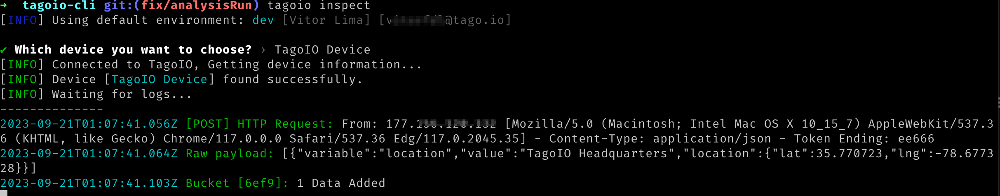

<br/>
<p align="center">
  </img>
</p>

# Table of Contents
- [TagoIO Command Line Tools](#tagoio-command-line-tools)
- [How to Install](#how-to-install)
- [Command List](#command-list)
- [Analysis Runner](#analysis-runner)
- [Credentials Storage](#credentials-storage)
- [tagoconfig.json](#tagoconfigjson)
- [Working with Environments](#working-with-environments)
- [License](#license)

For more information on the latest release notes, please visit the [Release Notes section](https://github.com/tago-io/tagoio-cli/releases)

## TagoIO Command Line Tools
TagoIO Command Line Tools is a CLI tool that allows you to interact with TagoIO platform and manage your applications. You can use it to deploy, run, trigger, and debug your analysis, as well as to inspect, backup, and configure your devices. You can also export your applications from one profile to another.

To use this tool, you need to install it globally with npm and also install the builder dependency. You also need to generate a tagoconfig.json file for your project and a .tago-lock file for your profile. You can work with multiple environments by using the init and set-env commands.

For more information about the commands and options of this tool, please refer to the [Command List](#command-list) section.




# How to Install

Installing the TagoIO Command Line Tools is a straightforward process. Follow these steps to get started:

1. **Preparation**: Ensure that Node.js and npm are installed on your machine. If not, refer to the [installation guide](^1^).
   
2. **CLI Tool Installation**: Open your terminal and run the following command to install the CLI tool globally:
   ```sh
   npm install -g @tago-io/cli
   ```
   
3. **Builder Dependency Installation**: Next, install the builder dependency using the command:
   ```sh
   npm install -g @tago-io/builder
   ```

4. **Project Initialization**: Initialize your project by generating a `tagoconfig.json` file. Use the command below and follow the on-screen instructions to provide your credentials or profile-token (available in your TagoIO account):
   ```sh
   tagoio init
   ```

5. **Profile Token Storage (Optional)**: To store your profile token in a `.tago-lock` file, use the `tagoio login` command. This step also allows you to work with different environments by adding an argument to the command:
   ```sh
   tagoio login
   ```

## Command List
List of commands of the CLI
**Usage**:
- tagoio [options] [command]

**Options**:
-  -V, --version                          output the version number
-  -h, --help                             display help for command

**Commands**:

| Command | Description |
| ---- | ---- |
| init [environment] | create/update the config file for analysis in your current folder |
| login [environment] | login to your account and store profile_token in the tago-lock. |
| set-env [environment] | set your default environment from tagoconfig.ts |
| list-env | list all your environment and show current default |
| whoami | show the active profile, scope, and config path (offline) |
| | |
| **Analysis** | |
| an-ls, analysis-list | get the list of analyses. |
| an-nf, analysis-info [ID] | get information about an analysis. |
| an-crt, analysis-create [name] | create a new analysis. |
| an-ed, analysis-edit [ID] | edit an analysis: rename it, change its runtime, variables, state or tags. |
| an-dlt, analysis-delete [ID] | permanently delete an analysis. |
| deploy, analysis-deploy [name] | deploy your analysis to TagoIO |
| run, analysis-run [name] | run your TagoIO analysis from your machine. |
| at, analysis-trigger [name] | send a signal to trigger your analysis TagoIO |
| ac, analysis-console [name] | connect to your Analysis Console |
| ad, analysis-duplicate [ID] | duplicate your Analysis |
| am, analysis-mode [name] | change an analysis or group of analysis to run on tago/external |
| | |
| **Access** | |
| am-ls, access-management-list | get the list of access policies. |
| am-nf, access-management-info [ID] | get information about an access policy, including what it grants. |
| am-crt, access-management-create [name] | create a new access policy. |
| am-ed, access-management-edit [ID] | edit an access policy: rename it, change what it grants, or its tags. |
| am-dlt, access-management-delete [ID] | permanently delete an access policy. |
| | |
| **TagoSQL** | |
| sq-ls, sql-list | get the list of TagoSQL queries. |
| sq-nf, sql-info [ID] | get information about a TagoSQL query, including its SQL text. |
| sq-crt, sql-create [name] | create a new TagoSQL query. |
| sq-ed, sql-edit [ID] | edit a TagoSQL query: rename it, change its SQL, params or cache settings. |
| sq-run, sql-execute [ID] | run a TagoSQL query and print its rows. |
| sq-dlt, sql-delete [ID] | permanently delete a TagoSQL query. |
| sq-tbl, sql-tables | list the tables, columns and functions a TagoSQL query may use. |
| sq-rev, sql-version [ID] | read an earlier version of a TagoSQL query. |
| | |
| **Devices** | |
| dv-crt, device-create [name] | create a new device. |
| dv-dlt, device-delete [ID/Token] | permanently delete a device and all its data. |
| dv-ed, device-edit [ID/Token] | edit a device's name, tags, status, network/connector, or retention. |
| dv-tkn, device-token [ID/Token] | manage device tokens: create, delete, or list. |
| dv-prm, device-param [ID/Token] | manage device configuration parameters: set, delete, or list. |
| inspect, device-inspector [ID/Token] | connect to your Device Live Inspector |
| info, device-info [ID/Token] | get information about a device and it's configuration parameters. |
| dl, device-list | get the list of devices. |
| data [ID/Token] | get data from a device. |
| bkp, device-backup [ID/Token] | backup data from a Device. Store it on TagoIO Cloud by default |
| nc, device-network [ID/Token] | change the device network and/or connector |
| dv-tp, device-type [ID/Token] | change the bucket type to immutable or mutable |
| dv-cp, device-copy | copy data from one device to another |
| | |
| **Dashboards** | |
| copy-tab [dashboardID] | copy a tab of a dashboard to another tab |
| | |
| **Entities** | |
| en-ls, entity-list | list entities in the active profile |
| en-nf, entity-info [id] | show one entity's metadata and schema |
| en-crt, entity-create [name] | create a new entity (interactive by default; flag-driven via --schema-json) |
| en-ed, entity-edit [id] | update entity metadata (name) |
| en-dlt, entity-delete [id] | permanently delete an entity |
| en-dt, entity-data [id] | read / write / edit / delete / empty / count entity records |
| en-sch, entity-schema [id] | manage entity schema (fields + indexes) |
| en-cp, entity-copy | copy data from one entity to another within the same profile |
| | |
| **Files** | |
| fl-up, files-upload <localPath> [remotePath] | upload a local file or folder to TagoIO Files |
| fl-url, files-url <remotePath> | print the URL of a file already in TagoIO Files |
| fl-ls, files-list [path] | list files and folders under a path in TagoIO Files |
| fl-mv, files-move <from> <to> | move a file or folder prefix to a new path |
| fl-rn, files-rename <path> <newName> | rename a file or folder in place (keeps its directory) |
| fl-cp, files-copy <from> <to> | copy a file or folder prefix to a new path |
| fl-dlt, files-delete <path> | delete a file or every file under a folder prefix |
| fl-dl, files-download <remotePath> [localDest] | download a file or folder prefix to the local disk |
| fl-prm, files-permission <path> <visibility> | make a file or folder public or private |
| | |
| **Actions** | |
| act-ls, action-list | get the list of actions. |
| act-nf, action-info [ID] | get information about an action, including its trigger and target. |
| act-crt, action-create [name] | create a new action. |
| act-ed, action-edit [ID] | edit an action's name, description, status, tags, trigger, or target. |
| act-on, action-enable [ID] | activate an action. |
| act-off, action-disable [ID] | deactivate an action without deleting it. |
| act-dlt, action-delete [ID] | permanently delete an action. |
| | |
| **Dictionaries** | |
| dc-ls, dict-list | get the list of dictionaries. |
| dc-nf, dict-info [ID] | get information about a dictionary and its languages. |
| dc-crt, dict-create [name] | create a new dictionary. |
| dc-ed, dict-edit [ID] | edit a dictionary's name, slug, or fallback language. |
| dc-lng, dict-lang [ID] <locale> | read, write, or delete one language inside a dictionary. |
| dc-dlt, dict-delete [ID] | permanently delete a dictionary and every language in it. |
| | |
| **Secrets** | |
| se-ls, secret-list | get the list of secrets. |
| se-nf, secret-info [ID] | get information about a secret. |
| se-crt, secret-create [key] | create a new secret, typing its value at a masked prompt. |
| se-ed, secret-edit [ID] | rotate a secret's value or change its tags. |
| se-dlt, secret-delete [ID] | permanently delete a secret. |
| | |
| **Run** | |
| ru-ls, run-user-list | get the list of TagoRUN users. |
| ru-nf, run-user-info [ID] | get information about a TagoRUN user. |
| ru-crt, run-user-create [email] | create a new TagoRUN user, typing the password at a masked prompt. |
| ru-ed, run-user-edit [ID] | edit a TagoRUN user, reset their password or change their tags. |
| ru-dlt, run-user-delete [ID] | permanently delete a TagoRUN user. |
| | |
| **Profiles** | |
| export, app-export | export application from one profile to another |
| backup [command] | profile backup management commands |
| backup create | create a new profile backup |
| backup list | list all profile backups |
| backup restore | restore profile from a backup |
| backup download | download a backup file to local folder |

## Analysis Runner
When writing up your analysis, make sure you have the following lines at end of the code:

```javascript
Analysis.use(startAnalysis, { token: process.env.T_ANALYSIS_TOKEN });

```

`tagoio run` executes your TypeScript file directly using Node's native experimental-transform-types runtime, so no build step or loader configuration is required. The `-d` flag forwards to Node so you can attach a debugger.

## Working with Environments

Managing multiple environments is a breeze with the TagoIO CLI. This feature facilitates seamless alternation between different environments for deployment and analysis management. Here's how you can make the most of it:

### Creating a New Environment
To set up a new environment, use the `tagoio init` command. This will guide you through the necessary steps to establish a fresh environment for your project. Here's how you can do it:

```sh
tagoio init
```

### Switching Between Environments
If you are working with multiple environments, switching between them is essential. Use the `tagoio set-env` command to change your current environment effortlessly. Here's the command to use:

```sh
tagoio set-env [environment_name]
```


## Credentials Storage

Securing your credentials is a critical aspect of working with the TagoIO CLI. The CLI ensures the safe storage of your Profile-Token, which is vital for accessing various functionalities. Here's how the credentials storage works:

### Storing Your Profile-Token

When you execute commands like `tagoio login` or `tagoio init`, the CLI securely stores your Profile-Token in the current folder accessed by your terminal. Here's a brief on these commands:

1. **tagoio login**: This command allows you to log in to your account, storing the profile token in the process.
   
   ```sh
   tagoio login
   ```

2. **tagoio init**: This command initiates the creation of a new project, during which you will be prompted to enter your credentials, generating a Profile-Token.
   
   ```sh
   tagoio init
   ```

### File Encryption

The stored Profile-Token is encrypted and saved in a file named `.tago-lock.{env}.lock`, ensuring the security of your sensitive information.

## tagoconfig.json
The `tagoconfig.json` file serves as the central configuration file for your JavaScript or TypeScript project when working with the TagoIO CLI. This file contains vital information about your analysis, including their IDs and names. Here's how you can set up and utilize the `tagoconfig.json` file effectively:

### Creating the tagoconfig.json File

To create a `tagoconfig.json` file, initiate your project using the `tagoio init` command. This command sets up the necessary structure for your project, including the creation of the `tagoconfig.json` file.

```sh
tagoio init
```

If you are using the TagoDeploy service, you can configure the URLs for both the API and SSE:

- To set the URL for the API in the TagoDeploy service, update the `tagoDeployUrl` field in the `tagoconfig.json` file with the URL of your server.
- To set the URL for SSE in the TagoDeploy service, update the `tagoDeploySse` field in the `tagoconfig.json` file with the URL of your server.

### File Contents

The `tagoconfig.json` file encapsulates information about your current project, including:

- **Analysis Details**: Information about your analysis, including their IDs and names.
- **Environment Configurations**: Details about the environments configured for your project.
- **Other Settings**: Additional settings and configurations specific to your project.

### Utilizing the tagoconfig.json File

Having a `tagoconfig.json` file is essential for executing several commands, such as:

- **tagoio deploy**: This command deploys your project to the TagoIO platform.
  
  ```sh
  tagoio deploy           # Detect the current runtime
  tagoio deploy --deno    # Force Deno runtime
  tagoio deploy --node    # Force Node.js runtime
  ```

- **tagoio trigger**: Use this command to trigger specific actions or events in your project.
  
  ```sh
  tagoio trigger
  ```

- **tagoio run**: This command allows you to run your project locally for testing and development.
  
  ```sh
  tagoio run            # Detect the current runtime
  tagoio run --deno     # Force Deno runtime
  tagoio run --node     # Force Node.js runtime
  ```


## Using in CI/CD Pipelines

Deploy every analysis from `tagoconfig.json` directly from a GitHub Actions workflow — no need to maintain a custom deploy script per project:

```yaml
- name: Install TagoIO CLI and builder
  run: npm install -g @tago-io/cli @tago-io/builder

- name: Deploy analyses to TagoIO
  run: tagoio deploy --all --env production -t ${{ secrets.TAGOIO_TOKEN }} --silent
```

The flag combination:
- `--all` — deploys every analysis registered in `tagoconfig.json` without any interactive prompt
- `--env, --environment` — picks the environment block from `tagoconfig.json`
- `-t, --token` — a TagoIO token. Accepts either a **profile token** or an **external-analysis token** (see permissions below). Bypasses the local `.tago-lock` file, which doesn't exist in CI runners
- `--silent` — skips confirmation prompts

Together, the command runs fully non-interactively — suitable for any CI/CD system. No call to `tagoio init` or `tagoio login` is required before deploy, but your repository **must** include a pre-configured `tagoconfig.json` mapping each analysis file to its analysis ID.

### Required permissions when using an external-analysis token

Profile tokens always have full access and need no extra setup. If you'd rather use a scoped external-analysis token (recommended for least-privilege CI pipelines), create an Access Management rule in TagoIO with the **Analysis** resource type and the following permissions enabled:

- **Access Analysis**
- **Edit Analysis**
- **Upload Analysis Script**

Attach that rule to the token you pass via `-t, --token`. Without these permissions, `tagoio deploy` will fail with an Authorization Denied error from the TagoIO API.


## License

TagoIO SDK for JavaScript in the browser and Node.js is released under the [Apache-2.0 License](https://github.com/tagoio-cli/blob/master/LICENSE.md).
